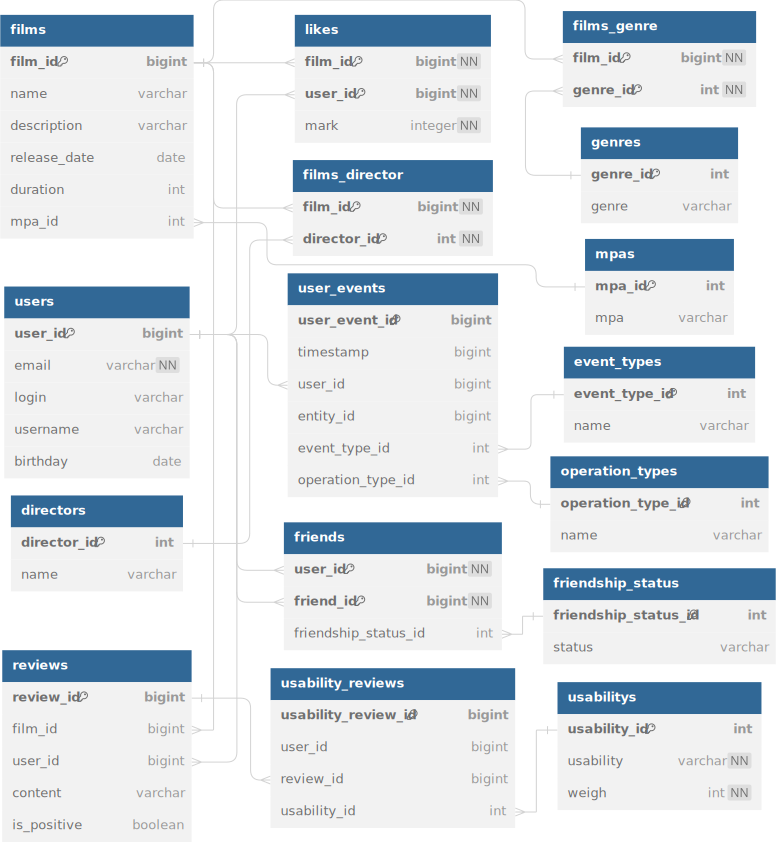

# CineMania!

CineMania is a social platform for movie enthusiasts where users can make friends, leave reviews, and recommend films. Features include search, reviews, shared films, recommendations, and an activity feed to track friends' actions. Users can also browse popular movies by genre and year. The platform supports both user and administrative APIs.

The database contains information about films (**table films**) and users (**table users**).
Each film can have several genres (**table genre**), rating of the Motion Picture Association (abbreviated as MPA). This rating determines the age limit for the film. The user can like each movie (**likes table**).

A user can send a friend request to another user. Status for a “friendship” (**table friendship_status**) connection between two users:
* unconfirmed - when one user sent a request to add another user as a friend,
* confirmed - when the second user agreed to be added.

After replacing likes with ratings, the rating system has changed. Now the rating is calculated as an arithmetic mean. A score from 1 to 5 is considered negative, a score from 6 to 10 is considered positive.

Now the recommendation algorithm searches for similar ratings among other users, and recommends movies only with a positive average rating.

In the answers, where sorting by the number of likes used to take place, sorting by average rating is now taking place.

## Database structure
